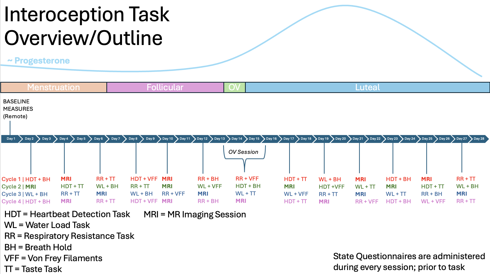
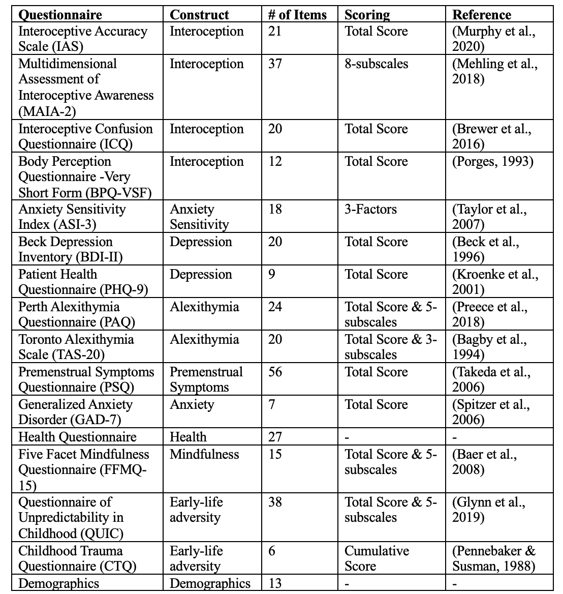

# Study Overview

## Study Details

## Baseline Session
- Completed on Zoom.
- Participants are administered the full standard M.I.N.I. (minus Suicide Module)
- Participants then complete a set of questionnaire on REDCap befor their first in-person session.

## Behavioral Sessions
- During the lab sessions, the participant first completes the state questionnaire on an iPad. The researcher then shares with the participant which two tasks they would be completing that session. Participants then complete one of the three primary interoceptive tasks (Heartbeat Detection, Water Load, or Respiratory Resistance) followed by one of the three secondary tasks (Breath Hold, Taste Test or Von Frey Filaments). All questionnaires and lab tasks are described in detail below.

## MRI Sessions
- Participant completes State questionnaires & metal screening

- Scan Sequence (for detailed parameters see below)
  - MPRage
  - VIA Task (x3)
  - Resting State
  
- Post-scan
  - Blood Sample collected
  - Stool kit given for at home collection

## Questionnaires

- **Baseline Questionnaires**
  
   
- **M.I.N.I.**
  - During the baseline zoom session, participants will complete the Mini International Neuropsychiatric Interview (M.I.N.I.; Sheehan et al., 1998)

- **State Questionnaire**
  - At the beginning of each session, participants will complete a set of state questionnaires. The following constructs are assessed using a VAS: valence, arousal/activation,  How depressed do you feel today?, How anxious do you feel today?, Fatigued, How well can you sense your body today?, How in-touch with your body are you today?, How much are you worrying about your body sensations today?, How Stressed do you feel today?. Participants also report whether or not they felt sick (yes or no) and the amount and time since they last consumed: food, caffeine, alcohol, diet pills, sleeping pills, and tobacco.
  

## Tasks
- **Heartbeat Detection Task (HDT)**
  - Run HBD Python Task (40 trials; 200ms & 500ms fixed offsets)
  - All data automatically recorded
  - Also run exteroceptive Condition (10 trials)
  
 

- **Water Load (WL)**
  - Fill each jug (2) with 1.5mL of room temperature water
  - Participant is given one of the jugs and the following instructions:
    - ‘During the following five minutes, we ask you to drink water until perceiving a sign of satiation. By satiation we mean the comfortable sensation you perceive when you have eaten a meal and you have eaten enough, but not too much.’ 
  - After the first 5 min trial, the participant is given the second jug and instructed:
    - ‘We now ask you to drink again during five minutes. Please continue drinking until your stomach is completely full, that is, entirely filled with water.’
  - The experimenter leaves the room for both 5-min trials
  - Experimenter records the amount of water drank from each jug.

- **Respiratory Resistance (RR)**
  - 10s trials
  - 5 levels of resistance (4 filters + 1 no filter trial) each presented 1x in random order
  - Participant cannot see which filter is being placed
  - Order of resistance presented is randomized
  - During this task, participants will breathe through a mask covering both the mouth and nose, connected to a two-way non-rebreathing valve (Ambu Mark III, Ambu GmbH) via a bacterial and viral filter. The inlet valve will be connected to a plastic tube to which the inspiratory load can be attached. We plan to use Hans Rudolph Linear Resistors 7100R providing a passive restriction of the inspiratory air flow by the following resistances: 0, 5, 10, 25 and 50 cmH20/liters per second (LPS). The linear resistors will be placed on the inspiratory plastic tubing for 10 s which corresponded to an average of 2 breathing cycles. After the 10s trial, participants will rate their subjective effort, unpleasantness, intensity, difficulty, stress, and fear using a VAS for each.

- **Breath Hold (BH)**
  - Participant places nose clip on nose
  - Instruct participant to “exhale all air out of your lungs, then take a deep breath in and then hold it as long as you can tolerate.”
    - Participant does not exhale during breath hold
  - The trial lasts up to 2-min and the participant exhales into the capnometer.
  - Experimenter records:
    - Duration of breath (seconds)
    - PEF (L/min)
    - FEV1 (L)
  - Participant completes VAS ratings
  - 2-min break between trails; two trials total

- **Taste Task (TT)**
  - For the Taste test, participants are provided with 5 flavors of jellybeans (Juicy Pear, Bubble Gum, Buttered Popcorn, Sizzling Cinnamon, and Sunkist Tangerine), one at a time. After eating each jellybean, participants rate the flavor on the five basic tastes, using a continuous VAS for each basic taste (sweet, sour, salty, bitter, and umami). In between each jellybean participants rinse their mouth with water and the presentation order of flavors is fully randomized for each session. 

- **Von Frey Filaments (VFF)**
  - Press VFF into palm of participant hand for 10s; Participants then make VAS rating
  - Complete each of the filaments (1x) with random order presentation (5 trials total)
  - Participant eyes closed

- **Visceral Interoceptive Attention (VIA; Completed during MRI)**
  - Participants will complete 3 runs of the Visceral Interoceptive Attention (VIA) Task in the MRI machine. During each run, participants will be presented with cues to different body locations (“Heart”, “Lungs”, “Uterus”, “Target” (exteroceptive condition)). They will be instructed to attend to the body location represented by the cue while the cue is on the screen. Additionally, participants will complete a simple attention check (intensity ratings) following 1/3 of trials to make sure they are still engaged in the task1. Stimuli will be presented in a fixed-random order across sessions, with each run having a different order (i.e., 3 versions of the task, each presented once per session). Additionally, each trial will have a mean ITI of 4000ms (range 2000ms – 6000ms). All components of the task will be TR-locked.
  
  

## MRI Parameters
- During the neuroimaging sessions, participants complete a localizer scan, a MPRage, three runs of the VIA task, and a resting state fMRI (rs-fMRI) scan. Scans are always collected in the same order. All scans are collected using a Siemens 3 Tesla PRISMA with a 32-channel head coil. 
- The following parameters are used for the MPRage scan: 1900ms repetition time (TR), 2.48 echo time (TE), 9° flip angle (FA), 256 mm field of view (FOV), 208 slices (1 mm thickness), 4:33 min acquisition time (TA). 
- The following parameters are used for all functional MRI scans: echo-gradient EPI, acquired axially A >> P, 2000ms TR, 30ms TE, 75° FA, 3.4 x 3.4 x 4.0 mm3 voxel size, 220 FOV, 33 slices (4.0mm thickness) , interleaved acquisition. For each run of the VIA task, the scan has an acquisition time of 5:28 min (162 volumes). For the rs-fMRI the scan has an acquisition time of 7:00 min (208 volumes). A fixation cross is presented during the rs-fMRI and participants were instructed to keep their eyes open, but blink normally. 

## Biosamples
- Blood
  - Venipuncture blood draw collected by CTRC Mobile Nursing Staff
  - 10mL Blood collected (EDTA Lavendar Tube) after MRI scan session
  - Centrifuge for 10 min (2000rcf; 20C)
  - Pipette plasma and residual blood into cryovials
  - Stored in -80C freezer until sent for analysis

  
- Stool
  - Following each MRI session, participants are provided with a Omnigene Gut Kit from DNAGenotek to take home with them. They complete the stool sample at home and return the stool kit at one of their following sessions. The stool will be processed using shotgun metagenomic sequencing.
  
## Cycle Tracking
- Prior to the first month of data collection, participants will complete at daily at home urine assessments of luteinizing hormone (LH) to help characterized their menstrual cycle. Participants will continue to complete LH testing at home throughout the study, but testing will be limited to the end of menstruation through several days after their LH peak (i.e., ovulation). 
- In addition to the LH tracking, participants will report the start and end dates of menstruation for the time preceding date collection and throughout their enrollment in the study. These self-reported dates will be used to align data to the start of each menstrual cycle (first day of menstruation). 

## Funding
N/A
